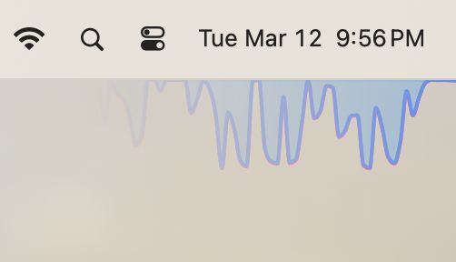
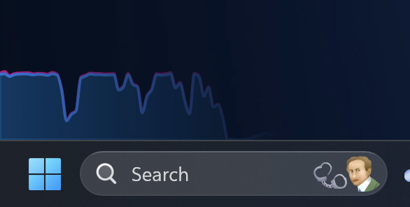

# System Monitor

Cross-platform Widget showing download/upload speed at the corner of your screen, with minimal overhead.

**example:**

|                         macOS                         |                        Windows                         |
| :---------------------------------------------------: | :----------------------------------------------------: |
|  |  |

## Download

| OS      | Processor     | Download                                                                                                                                                                                                                                                                                                                                                                  |
| ------- | ------------- | ------------------------------------------------------------------------------------------------------------------------------------------------------------------------------------------------------------------------------------------------------------------------------------------------------------------------------------------------------------------------- |
| MacOS   | Apple Silicon | - [Installer](https://github.com/ZibanPirate/sysmon/releases/latest/download/System.Monitor_0.0.32_aarch64.dmg) - [Standalone](https://github.com/ZibanPirate/sysmon/releases/latest/download/System.Monitor_aarch64.app.tar.gz)                                                                                                                                       |
| MacOS   | Intel         | - [Installer](https://github.com/ZibanPirate/sysmon/releases/latest/download/System.Monitor_0.0.32_x64.dmg) - [Standalone](https://github.com/ZibanPirate/sysmon/releases/latest/download/System.Monitor_x64.app.tar.gz)                                                                                                                                               |
| Windows | Arm           | N/A                                                                                                                                                                                                                                                                                                                                                                       |
| Windows | x86           | - [Installer](https://github.com/ZibanPirate/sysmon/releases/latest/download/System.Monitor_0.0.32_x64-setup.exe) - [NSIS Installer](https://github.com/ZibanPirate/sysmon/releases/latest/download/System.Monitor_0.0.32_x64-setup.nsis.zip) - [MSI Installer](https://github.com/ZibanPirate/sysmon/releases/latest/download/System.Monitor_0.0.32_x64_en-US.msi) |
| Linux   | Arm           | N/A                                                                                                                                                                                                                                                                                                                                                                       |
| Linux   | x86           | N/A                                                                                                                                                                                                                                                                                                                                                                       |

## Contributing

Contributions are welcome, please read [`CONTRIBUTING.md`](./CONTRIBUTING.md) to get started.

here's a rough roadmap of the project

### Checklist

- [x] gether Network speed (`./lib-cpp` and `./lib-swift`)
- [x] show network speed graph on an always-on-top widget, and on tray icon text
- [x] Auto-update
- [ ] improve rust code quality: no-unwrap, tests, clippy on CI
- [ ] improve lib-cpp and lib-swift code quality
- [ ] Telemetry data on user consent
- [ ] Linux support
- [ ] Apple Store support
- [ ] more widgets
  - [ ] CPU
  - [ ] RAM
  - [ ] Storage
- [ ] optimize Widgets for low CPU consumption

# migration checklist

- todo-zm: settings window flash before loading in Windows
- todo-zm: secrets
- todo-zm: bug: tray menue can be hidden in Windows via settings (should we detect it?)
- todo-zm: bug: auto-start sometimes not working on Windows
- todo-zm: bug: network widget flashes a scroll bar real quick when ran on windows in debug mode
- todo-zm: have a landing page for https://sysmon.zak-man.com
