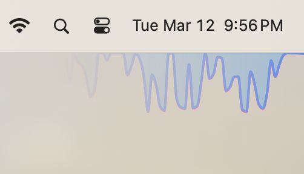

# System Monitor

Widget to see the download/upload speed at the corner of your screen, with minimal overhead.

**example:**

## Download

| OS      | Processor     | Download                                                                                                                                                                                                                             |
| ------- | ------------- | ------------------------------------------------------------------------------------------------------------------------------------------------------------------------------------------------------------------------------------ |
| MacOS   | Apple Silicon | - [Installer](https://github.com/ZibanPirate/sysmon/releases/latest/download/System.Monitor_0.0.21_aarch64.dmg)  - [Standalone](https://github.com/ZibanPirate/sysmon/releases/latest/download/System.Monitor_aarch64.app.tar.gz) |
| MacOS   | Intel         | - [Installer](https://github.com/ZibanPirate/sysmon/releases/latest/download/System.Monitor_0.0.21_x64.dmg)  - [Standalone](https://github.com/ZibanPirate/sysmon/releases/latest/download/System.Monitor_x64.app.tar.gz)         |
| Windows | Arm           | _coming soon_                                                                                                                                                                                                                        |
| Windows | x86           | _coming soon_                                                                                                                                                                                                                        |
| Linux   | Arm           | _coming soon_                                                                                                                                                                                                                        |
| Linux   | x86           | _coming soon_                                                                                                                                                                                                                        |

## Contribution

the project is a mess now, but feel free to fork and modify the code.

once things are a bit clear, I will update this section.

a rough roadmap is compiled into the checklist bellow

### Checklist

- [x] gether Network speed
- [x] show network speed graph on an always-on-top widget
- [x] Auto-update
- [x] persist and apply settings
- [ ] Windows support
- [ ] Linux support
- [ ] Submit to Apple Store
- [ ] code quality: no-unwrap, tests
- [ ] Telemetry data on user consent
- [ ] more widgets
  - [ ] CPU
  - [ ] RAM
  - [ ] Storage
- [ ] optimize Widgets for low CPU consumption

### Recommended IDE Setup

- [VS Code](https://code.visualstudio.com/) + [Tauri](https://marketplace.visualstudio.com/items?itemName=tauri-apps.tauri-vscode) + [rust-analyzer](https://marketplace.visualstudio.com/items?itemName=rust-lang.rust-analyzer)
